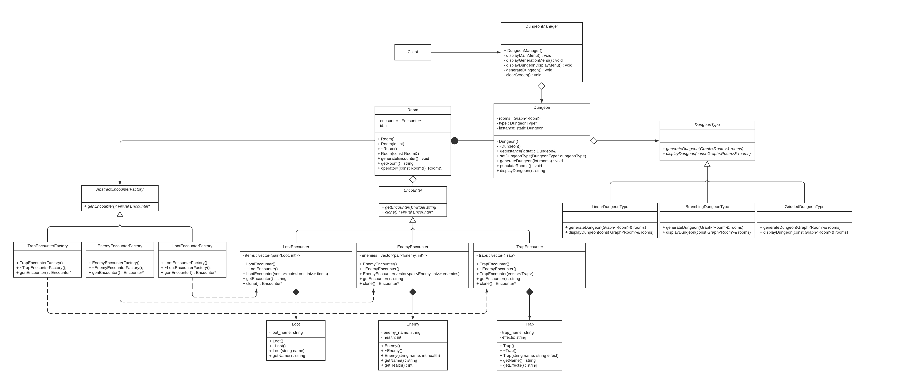

# Tabletop RPG Dungeon Designer
 > Authors: [Aaron Geesink](https://github.com/roveredpwn), [Garrett Geesink](https://github.com/chatmansave),  [Emerson Jacobson](https://github.com/emwjacobson)

## Project Description

#### General Description:

This program is a terminal based dungeon map generation tool for use in tabletop roleplaying games. The user has three dungeon generations types to choose from: a linear dungeon generation that creates a dungeon map that can only be progressed in one direction, a branching dungeon, which contains rooms that move in a somewhat linear fashion with branching paths between rooms, and a gridded dungeon, which generates a random grid of adjacent rooms. The user has the ability to change the paramets for the dungeon generation, which includes the number of rooms, and the type of dungeon to generate. Once the dungeon map is generated, each room within the dungeon will be populated with encounters such as dungeon loot, traps, and enemies. Once all of the dungeon generation parameters are set, the dungeon map will be displayed in ASCII text to the terminal, and the user will be able to view the generated dungeon layout as well as the encounters within each room of the dungeon. The user will then be able to regenerate the encounters within the generated dungeon map or generate a new dungeon of the same dungeon type if they want another dungeon layout.

#### Why it is important:

This project is important for our group because we are all interested in playing tabletop roleplaying games such as Dungeons and Dragons. In these games, the game master overseeing the actions of the game is often tasked with creating game resources for roleplaying fantasy scenarios, including making intricate maps for dungeons that the players will be encountering while playing. Making dungeon maps for Dungeons and Dragons and filling each room in the dungeon with interesting encounters can take a lot of time, so having a way to automate the map generation for dungeons would allow for the game master to focus on the other aspects of game preparation such as creating interesting characters and story. Angular, grid based maps are especially suited for playing in AD&D Second Edition, which is the primary tabletop RPG that two of the project members play.

#### Languages/Tools/Technologies:

[C++](https://www.cplusplus.com/) - This project will be programmed primarily using C++ 11.

[Visual Studio Code](https://code.visualstudio.com/) - This is a text and code editor that we will use to write and test code in Windows.

[Git](https://git-scm.com/) - Git allows us to make changes to the GitHub repository, either through Linux, or through Windows using Git Bash.

[Valgrind](https://valgrind.org/) - Valgrind is a Linux tool which detects errors and memory management bugs in C++ code. We will use it to fix memory leaks in our code.

[Vim](https://www.vim.org/) - Vim is a text editor that allows us to edit code in Linux.

[Github](https://github.com/) - GitHub is a version control system that allows multiple users to share and edit code together online, as well as manage the development of the project with a collection of Agile tools. Github allows for the creation of task boards to sort features into “To-do, doing, done” categories to organize the implementation of program features between multiple group members.

[Lucidchart](https://www.lucidchart.com/) - Lucidchart is a free cloud based diagram and flowchart design software. We will use it to make OMT class diagrams and other program diagrams for our project.

[CMake](https://cmake.org/) - CMake is a Linux tool which allows us to compile C++ code into executable programs that will run in Linux.

[Google Test Framework](https://github.com/google/googletest) - This is a collection of tools made by Google which will allow us to create and run test cases for our project code. This will allow us to test the functionality and edge cases for our program and ensure that all program inputs have the intended outputs.

#### Program inputs/outputs:

Inputs - The user-specified parameters that will be used to generate a dungeon layout. The user will be able to specify the type of dungeon to generate, as well as the number of rooms in the dungeon. In addition, once a dungeon has been generated, the user will be able to regenerate the encounters in eahc room of the current dungeon, or randomly generate a new dungeon with the same dungeon type. This will all be done through menu prompts in the program.

Outputs - The program will use the user-specified parameters to randomly generate a dungeon with those parameters. The objects of a dungeon will be stored within a graph data structure after it is generated. The program will also visually output the layout of the generated dungeon to the screen using ASCII characters.

#### Program Design Patterns:

The three design patterns we will be using for this project are Abstract Factory, Strategy, and Singleton.

The Abstract Factory design pattern will be used to generate a variety of different Encounters for our dungeon. Each room in our dungeon can have one of three types of encounters: an enemy, a trap, or loot. For each of these types of encounters, there will be a variety of factors that can be different. For example, an enemy encounter could be 3 Skeletons, 4 Large Spiders, 2 Skeletons and 3 Zombies. Each of the different types of encounters will have a list of elements to choose from, and these elements will be put together to create an Encounter class object of the specified encounter type.  Using the abstract factory design pattern means that we will not need to determine the exact nature of these encounters ahead of time, and instead we will be able to build the encounters dynamically at runtime. Jacob Emerson will be responsible for this design pattern.

The Strategy design pattern will be used for the dungeon generation algorithms to choose between different algorithms to generate the dungeons. There are three different algorithms to choose from when generating a dungeon: a LinearDungeon algorithm, a BranchingDungeon algorithm, and a GriddedDungeon algorithm. The LinearDungeon algorithm will generate a dungeon consisting of a straight line of rooms. The BranchingDungeon algoriuthm will create a dungeon similar to a linear dungeon, with a straight line of rooms, but some rooms have additional rooms above or below it, creating a branching path of rooms to traverse through. The GriddedDungeon algorithm will generate a dungeon which contains adjacent rooms connected in a nonlinear fashion, resembling a dungeon from games such as the orignal Legend of Zelda or the Binding of Isaac. Aaron Geesink will be responsible for this design pattern.

The Singleton design pattern will be used for the Dungeon class, as we only want to create one dungeon at any given moment. We will be able to modify that dungeon in order to produce different dungeon layouts using the same dungeon object. For example, we will have the option to regenerate the contents of each of the dungeon rooms, or generate a new dungeon using the same parameters. Singleton is useful in this case because it allows us to keep using a dungeon layout until the user decides to generate an entirely new dungeon with different parameters. Garrett Geesink will be responsible for this design pattern.

 Example of the Menu Design can be found [by clicking this link](DesignDocs/MenuDesign.pdf)

## Class Diagram
 
 
 Above is the OMT class Diagram for the Tabletop RPG Dungeon Designer program. The Program functions by creating the necessary data for the Dungeon class so that it can be used to display the contents of a dungeon to the screen. The DungeonManager class is composed of a Dungeon object. When the startDungeonManager() function is called from main, a case begins to handle the UI of the program and call the functions in the Dungeon class to correctly create a display a Dungeon object. The Design for the menus of out progrem can be found in the directory ( [MenuDesign](DesignDocs/MenuDesign.pdf) ) in this repository. The displayMainMenu() function displays a main menu UI for the program. The displayGenerationMenu() function displays the Dungeon Generation Menu, while the displayDungeonDisplayMenu() function displays the Dungeon Display Menu. Each menu has it's own case control structure to handle the inputs for that respective menu. when the "Quit program" in the main menu is selected, the startDungeonManager() function returns back to main and the program ends.

 The dungeon class uses the Singleton design pattern to ensure that only one instance of dungeon is created at a time so that the DungeonManager will only be able instantiate and manage one Dungeon object at a time. The Dungeon class contains a Graph of Room objects for the dungeon, as well as an Instance() function to get the static instance of the class. A dungeon object is instantiated without having any rooms or having a dungeonType.
 
 The DungeonType class is an abstract class that uses the Strategy design pattern to implement a GenerateDungeon() function and a displayDungeon() function for each of the three types of dungeons. The rooms for the dungeon will be created and added as nodes on the graph, and the generateDungeon functions will add edges to each node according to the desired dungeon. For the LinearDungeonType, the rooms will be connected in a linear order (1 to 2 to 3, etc). For the BranchingDungeon Type, the rooms will be connected so that there are different branching paths to the dungeon (example: for a dungeon with 5 rooms, two paths might exist: 1 to 2 to 5, or 1 to 3 to 4 to 5). For the GriddedDungeonType, the rooms of the dungeon will be connected randomly to already connected rooms (example: for a dungeon with 4 rooms, room 2 will be connected to a random side of room 1, room 3 will be connected to a random side of both room 2 or 3 that doesn't have a room connection, and room 4 will be connected to a random side of room 1, to, or 3 that doesn't have a room connection). The displayDungeon functions for each dungeon type will display the dungeons using text, either by drawing the dungeon layout using ascii art or by displaying the dungeon layout through an adjacency list representation of nodes. When a dungeon is first instantiated, it's DungeonType will be set to LinearDungeonType by default.

 Rooms for a dungeon are created after the user inputs the number of rooms they want in their dungeon. The generateDungeon() function in the Dungeon class accepts an int for the number of rooms to create, and a graph with that many rooms is created and set to rooms in the Dungeon class. When a room is instantiated, it is assigned an id number representing its room number in the order that the rooms are created, starting at id number 1. the generateEncounter() function randomly creates an Encounter object through the use of the Abstract Factory Design pattern. generateEncounter() is also called during the constructor for the Room class. this function will randomly create either a LootEncounter, EnemyEncounter, or a TrapEncounter through the use of one of the three concrete implementations of the AbtsractEncounterFactory. When an Encounter is created using one of the factories, the concrete product of the Encounter is created. Each encounter has a vector of objects for that specific type of encounter, and the encounter objects will randomly select an encounter by randomly rolling the number of unique encounters, the type of encounter, and the number of things that will appear for each type. For example, if an EnemyEncounter is created, a result of 2 for the first roll means that there will be 2 type of enemies, and for each type of enemy 2 more rolls will be made to determine type and quantity. Then, two Enemy objects will be created and rolled for their type and quantity. The first enemy object could roll a 2 and a 4, which could mean 4 skeletons are in this encounter, and the second enemy object rolling 6 and 17 could mean 17 zombies would be part of the encounter.
 
 A string representation for each encounter will be returned to the Room class when the getEncounter() function is called by the getEncounter() function in the Room class, and the Dungeon class will call the getEncounter() function for each room so that it can display the encounters for each room in the Dungeon Display Menu.

 ## Screenshots
 Main Menu:
 

 Generate Dungeon Menu:
 

 Displaying a Linear Dungeon with 7 rooms:
 

 Regenerating Encounters for the Linear Dungeon:
 

 Displaying a Branching Dungeon with 5 rooms:
 

 Displaying a Gridded Dungeon with 4 rooms:
 

 ## Installation/Usage
 Using git, clone the repository, and `cd` into it.
```
git clone https://github.com/cs100/final-project-agees001-ggees001-ejaco020
cd final-project-agees001-ggees001-ejaco020
```

This project uses `cmake3` as well as `make`. These tools are available on Linux, and can be installed from their respective websites. After they’re installed, the following commands can be run to create executables. Optionally, Valgrind can also be installed to check for memory leaks in the program.

```
cmake3 .
make
```

The following executables will be created

```
dungeondesigner
test
```

Running `./dungeondesigner` will run the dungeon designer program to generate dungeons.

The program can be operated by selecting from the provdided options on each of the menus.
There are three menus to the program: the Main Menu, the Dungeon Generation Menu, and the Dungeon Display Menu.
In the Main Menu, you can choose to generate a dungeon or view the most recently generated dungeon.
In the Dungeon Generation Menu, you can select the type of dungeon you would like to generate, and then enter the number of rooms to be generated for that dungeon
In the Dungeon Display Menu, the dungeon that has been generated will be displayed. You will have the option to randomly generate new encounters for the current dungeon, or you can randomly generate a new dungeon with the same dungeon type.

 ## Testing
After following the instructions in the **Installation/Usage** section to generate the executables, running `./test` will run the unit tests for this program. These are used to verify functionality of each of the different classes in the program, confirming that each of them work as intended. Overall for this project, we had a total of 65 unit tests across 15 different suites. Each suite was made to test a specific class and its functions.

We also used Valgrind to make sure that there were no memory leaks in the program. We ran Valgrind against the main `dungeondesigner` executable as well as the `test` executable to be sure that all memory allocated was also deallocated. This test can be run using `valgrind --leak-check=full ./dungeondesigner` or `valgrind --leak-check=full ./test` to test the respective program.

 <details><summary>Example of the valgrind results and googleTests</summary>
<p>

```$ valgrind ./test
==22== Memcheck, a memory error detector
==22== Copyright (C) 2002-2017, and GNU GPL'd, by Julian Seward et al.
==22== Using Valgrind-3.15.0 and LibVEX; rerun with -h for copyright info
==22== Command: ./test
==22==
[==========] Running 65 tests from 15 test suites.
[----------] Global test environment set-up.
[----------] 4 tests from GriddedDungeonTest
[ RUN      ] GriddedDungeonTest.Generate1RoomGriddedDungeonTest
[       OK ] GriddedDungeonTest.Generate1RoomGriddedDungeonTest (57 ms)
[ RUN      ] GriddedDungeonTest.Generate0RoomGriddedDungeonTest
[       OK ] GriddedDungeonTest.Generate0RoomGriddedDungeonTest (4 ms)
[ RUN      ] GriddedDungeonTest.Generate2RoomGriddedDungeonTest
[       OK ] GriddedDungeonTest.Generate2RoomGriddedDungeonTest (42 ms)
[ RUN      ] GriddedDungeonTest.Generate10RoomGriddedDungeonTest
[       OK ] GriddedDungeonTest.Generate10RoomGriddedDungeonTest (47 ms)
[----------] 4 tests from GriddedDungeonTest (160 ms total)

[----------] 5 tests from LinearDungeonTest
[ RUN      ] LinearDungeonTest.Generate1RoomLinearDungeonTest
[       OK ] LinearDungeonTest.Generate1RoomLinearDungeonTest (6 ms)
[ RUN      ] LinearDungeonTest.PolymorphsismTest
[       OK ] LinearDungeonTest.PolymorphsismTest (3 ms)
[ RUN      ] LinearDungeonTest.Generate2RoomLinearDungeonTest
[       OK ] LinearDungeonTest.Generate2RoomLinearDungeonTest (6 ms)
[ RUN      ] LinearDungeonTest.Generate6RoomLinearDungeonTest
[       OK ] LinearDungeonTest.Generate6RoomLinearDungeonTest (6 ms)
[ RUN      ] LinearDungeonTest.Generate22RoomLinearDungeonTest
[       OK ] LinearDungeonTest.Generate22RoomLinearDungeonTest (19 ms)
[----------] 5 tests from LinearDungeonTest (41 ms total)

[----------] 4 tests from BranchingDungeonTest
[ RUN      ] BranchingDungeonTest.Generate1RoomBranchingDungeonTest
[       OK ] BranchingDungeonTest.Generate1RoomBranchingDungeonTest (5 ms)
[ RUN      ] BranchingDungeonTest.Generate0RoomBranchingDungeonTest
[       OK ] BranchingDungeonTest.Generate0RoomBranchingDungeonTest (2 ms)
[ RUN      ] BranchingDungeonTest.Generate2RoomBranchingDungeonTest
[       OK ] BranchingDungeonTest.Generate2RoomBranchingDungeonTest (6 ms)
[ RUN      ] BranchingDungeonTest.Generate10RoomBranchingDungeonTest
[       OK ] BranchingDungeonTest.Generate10RoomBranchingDungeonTest (24 ms)
[----------] 4 tests from BranchingDungeonTest (39 ms total)

[----------] 3 tests from RoomTest
[ RUN      ] RoomTest.GetEncounterNotEmpty
[       OK ] RoomTest.GetEncounterNotEmpty (5 ms)
[ RUN      ] RoomTest.GenEncounterNoThrow
[       OK ] RoomTest.GenEncounterNoThrow (2 ms)
[ RUN      ] RoomTest.GenDifferentEncounters
[       OK ] RoomTest.GenDifferentEncounters (6 ms)
[----------] 3 tests from RoomTest (13 ms total)

[----------] 19 tests from GraphTest
[ RUN      ] GraphTest.NoParameterConstructorTest
[       OK ] GraphTest.NoParameterConstructorTest (13 ms)
[ RUN      ] GraphTest.SingleParameterConstructorTest
[       OK ] GraphTest.SingleParameterConstructorTest (6 ms)
[ RUN      ] GraphTest.NegativeSingleParameterConstructorTest
[       OK ] GraphTest.NegativeSingleParameterConstructorTest (3 ms)
[ RUN      ] GraphTest.SameSizeInitializationTest
[       OK ] GraphTest.SameSizeInitializationTest (4 ms)
[ RUN      ] GraphTest.NegativeArrayInitializationTest
[       OK ] GraphTest.NegativeArrayInitializationTest (5 ms)
[ RUN      ] GraphTest.NegativeGraphInitializationTest
[       OK ] GraphTest.NegativeGraphInitializationTest (3 ms)
[ RUN      ] GraphTest.BothNegativeInitializationTest
[       OK ] GraphTest.BothNegativeInitializationTest (3 ms)
[ RUN      ] GraphTest.BiggerGraphThanArrayInitializationTest
[       OK ] GraphTest.BiggerGraphThanArrayInitializationTest (2 ms)
[ RUN      ] GraphTest.SmallerGraphThanArrayInitializationTest
[       OK ] GraphTest.SmallerGraphThanArrayInitializationTest (3 ms)
[ RUN      ] GraphTest.ZeroGraphSizeInitializationTest
[       OK ] GraphTest.ZeroGraphSizeInitializationTest (4 ms)
[ RUN      ] GraphTest.GetNodeTest
[       OK ] GraphTest.GetNodeTest (4 ms)
[ RUN      ] GraphTest.BidirectionalEdgeTest
[       OK ] GraphTest.BidirectionalEdgeTest (15 ms)
[ RUN      ] GraphTest.IdenticalNodesTest
[       OK ] GraphTest.IdenticalNodesTest (5 ms)
[ RUN      ] GraphTest.AddVertexNoExpandTest
[       OK ] GraphTest.AddVertexNoExpandTest (8 ms)
[ RUN      ] GraphTest.AddVertexWithExpandTest
[       OK ] GraphTest.AddVertexWithExpandTest (7 ms)
[ RUN      ] GraphTest.AddVertexExpandFromZeroTest
[       OK ] GraphTest.AddVertexExpandFromZeroTest (5 ms)
[ RUN      ] GraphTest.AddVertexExpandFromOneTest
[       OK ] GraphTest.AddVertexExpandFromOneTest (6 ms)
[ RUN      ] GraphTest.ClearGraphTest
[       OK ] GraphTest.ClearGraphTest (10 ms)
[ RUN      ] GraphTest.ClearEmptyGraphTest
[       OK ] GraphTest.ClearEmptyGraphTest (7 ms)
[----------] 19 tests from GraphTest (116 ms total)

[----------] 3 tests from LootTest
[ RUN      ] LootTest.NonEmptyName
[       OK ] LootTest.NonEmptyName (2 ms)
[ RUN      ] LootTest.SetEmptyName
[       OK ] LootTest.SetEmptyName (3 ms)
[ RUN      ] LootTest.SetName
[       OK ] LootTest.SetName (2 ms)
[----------] 3 tests from LootTest (7 ms total)

[----------] 3 tests from EnemyTest
[ RUN      ] EnemyTest.NonEmptyName
[       OK ] EnemyTest.NonEmptyName (2 ms)
[ RUN      ] EnemyTest.NonZeroHealth
[       OK ] EnemyTest.NonZeroHealth (2 ms)
[ RUN      ] EnemyTest.SetValues
[       OK ] EnemyTest.SetValues (4 ms)
[----------] 3 tests from EnemyTest (8 ms total)

[----------] 3 tests from TrapTest
[ RUN      ] TrapTest.NonEmptyVariables
[       OK ] TrapTest.NonEmptyVariables (2 ms)
[ RUN      ] TrapTest.SetEmptyVariables
[       OK ] TrapTest.SetEmptyVariables (2 ms)
[ RUN      ] TrapTest.SetVariables
[       OK ] TrapTest.SetVariables (3 ms)
[----------] 3 tests from TrapTest (9 ms total)

[----------] 4 tests from LootEncounterTest
[ RUN      ] LootEncounterTest.EncounterNotEmpty
[       OK ] LootEncounterTest.EncounterNotEmpty (1 ms)
[ RUN      ] LootEncounterTest.GetEncounterHasLoot
[       OK ] LootEncounterTest.GetEncounterHasLoot (11 ms)
[ RUN      ] LootEncounterTest.SingleLoot
[       OK ] LootEncounterTest.SingleLoot (4 ms)
[ RUN      ] LootEncounterTest.ThreeLoot
[       OK ] LootEncounterTest.ThreeLoot (5 ms)
[----------] 4 tests from LootEncounterTest (23 ms total)

[----------] 3 tests from DungeonTest
[ RUN      ] DungeonTest.DisplayDungeonTest
[       OK ] DungeonTest.DisplayDungeonTest (4 ms)
[ RUN      ] DungeonTest.GenerateDungeonTest
[       OK ] DungeonTest.GenerateDungeonTest (23 ms)
[ RUN      ] DungeonTest.populateRoomTest
[       OK ] DungeonTest.populateRoomTest (13 ms)
[----------] 3 tests from DungeonTest (42 ms total)

[----------] 4 tests from EnemyEncounterTest
[ RUN      ] EnemyEncounterTest.GetEncounterNotEmpty
[       OK ] EnemyEncounterTest.GetEncounterNotEmpty (1 ms)
[ RUN      ] EnemyEncounterTest.GetEncounterHasEnemy
[       OK ] EnemyEncounterTest.GetEncounterHasEnemy (4 ms)
[ RUN      ] EnemyEncounterTest.SingleEnemy
[       OK ] EnemyEncounterTest.SingleEnemy (4 ms)
[ RUN      ] EnemyEncounterTest.ThreeEnemies
[       OK ] EnemyEncounterTest.ThreeEnemies (4 ms)
[----------] 4 tests from EnemyEncounterTest (16 ms total)

[----------] 4 tests from TrapEncounterTest
[ RUN      ] TrapEncounterTest.EncounterNotEmpty
[       OK ] TrapEncounterTest.EncounterNotEmpty (1 ms)
[ RUN      ] TrapEncounterTest.GetEncounterHasLoop
[       OK ] TrapEncounterTest.GetEncounterHasLoop (2 ms)
[ RUN      ] TrapEncounterTest.SingleTrap
[       OK ] TrapEncounterTest.SingleTrap (4 ms)
[ RUN      ] TrapEncounterTest.ThreeTrap
[       OK ] TrapEncounterTest.ThreeTrap (4 ms)
[----------] 4 tests from TrapEncounterTest (14 ms total)

[----------] 2 tests from TrapEncounterFactoryTest
[ RUN      ] TrapEncounterFactoryTest.EncounterNotEmpty
[       OK ] TrapEncounterFactoryTest.EncounterNotEmpty (1 ms)
[ RUN      ] TrapEncounterFactoryTest.GetEncounterHasTrap
[       OK ] TrapEncounterFactoryTest.GetEncounterHasTrap (3 ms)
[----------] 2 tests from TrapEncounterFactoryTest (5 ms total)

[----------] 2 tests from LootEncounterFactoryTest
[ RUN      ] LootEncounterFactoryTest.EncounterNotEmpty
[       OK ] LootEncounterFactoryTest.EncounterNotEmpty (4 ms)
[ RUN      ] LootEncounterFactoryTest.GetEncounterHasLoot
[       OK ] LootEncounterFactoryTest.GetEncounterHasLoot (3 ms)
[----------] 2 tests from LootEncounterFactoryTest (7 ms total)

[----------] 2 tests from EnemyEncounterFactoryTest
[ RUN      ] EnemyEncounterFactoryTest.EncounterNotEmpty
[       OK ] EnemyEncounterFactoryTest.EncounterNotEmpty (2 ms)
[ RUN      ] EnemyEncounterFactoryTest.GetEncounterHasEnemy
[       OK ] EnemyEncounterFactoryTest.GetEncounterHasEnemy (3 ms)
[----------] 2 tests from EnemyEncounterFactoryTest (5 ms total)

[----------] Global test environment tear-down
[==========] 65 tests from 15 test suites ran. (560 ms total)
[  PASSED  ] 65 tests.
==22==
==22== HEAP SUMMARY:
==22==     in use at exit: 0 bytes in 0 blocks
==22==   total heap usage: 8,184 allocs, 8,184 frees, 827,201 bytes allocated
==22==
==22== All heap blocks were freed -- no leaks are possible
==22==
==22== For lists of detected and suppressed errors, rerun with: -s
==22== ERROR SUMMARY: 0 errors from 0 contexts (suppressed: 0 from 0)
```
